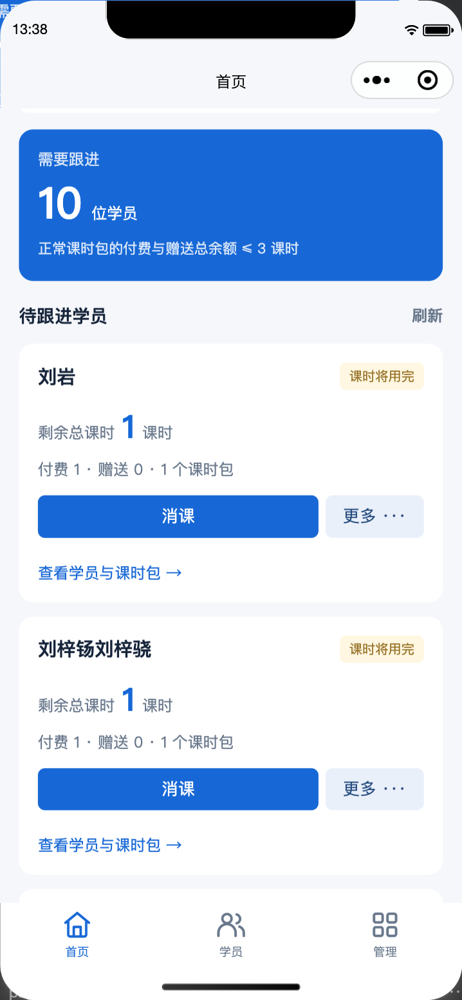
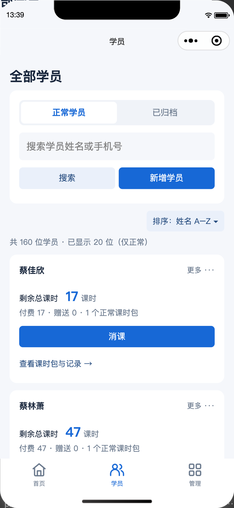
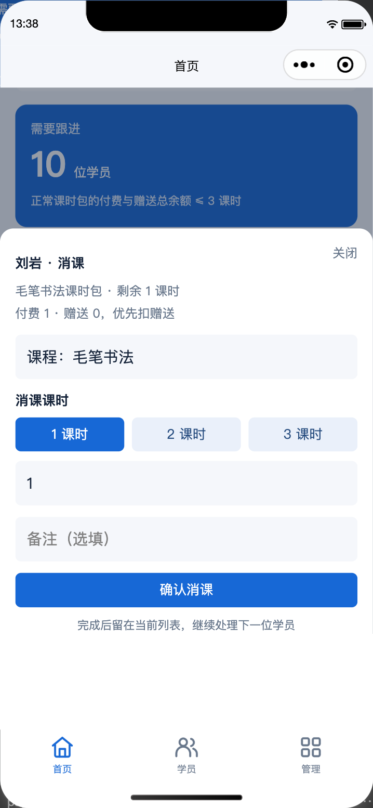
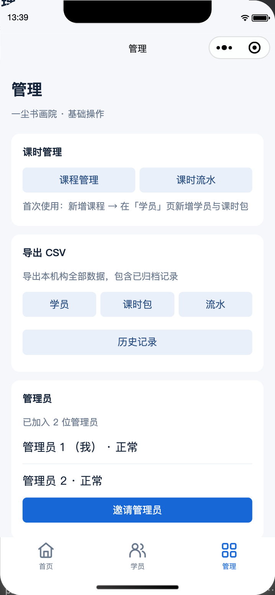
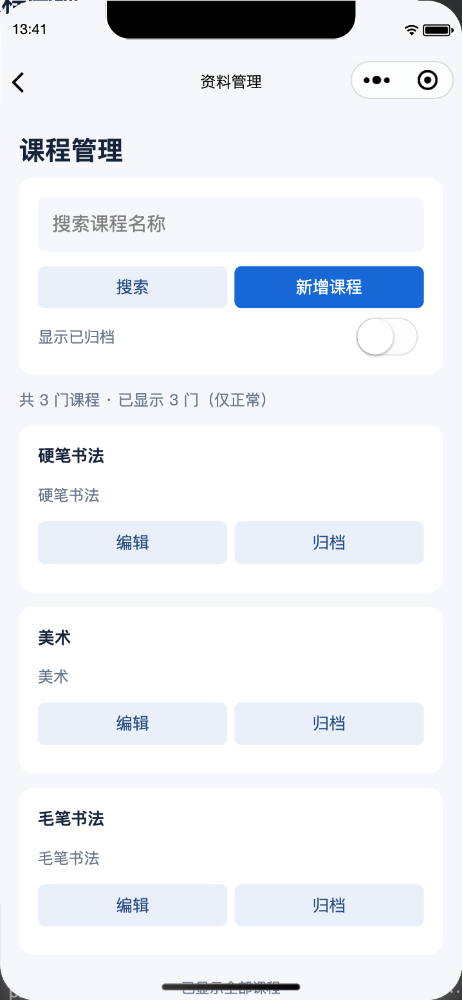

# 尘迹


面向培训机构的微信原生小程序课时管理工具。前端位于 `miniprogram/`，后端是 TypeScript、Hono、Cloudflare Workers 与 D1；数据通过不可变课时流水记录充值、消课和冲正。

当前功能包括：微信登录、机构与管理员邀请、课程、学员、共享课时包、充值、消课、冲正、普通归档、退学结清和 CSV 导出。项目也保留了旧系统历史记录的只读查询与迁移工具。

> 文档中的 AppID、域名、Secret、账号和数据库 ID 都必须替换为部署者自己的值；仓库不提供可直接使用的生产配置。

## 界面截图

| 首页 | 学员列表 | 消课 |
| --- | --- | --- |
|  |  |  |

| 管理 | 课程管理 | |
| --- | --- | --- |
|  |  | |

## 快速开始

### 本地开发

环境要求：Node.js（建议使用当前 LTS）、npm、微信开发者工具。首次安装依赖并初始化本地 D1：

```sh
npm install
npm run db:local
npm run dev
```

然后用微信开发者工具导入仓库根目录。开发者工具中的本地设置可关闭合法域名校验；本地 API 地址为 `http://127.0.0.1:8787`，需要在 `miniprogram/config.js` 中临时配置。若要测试微信登录，本地 Worker 还需要自己的 `worker/.dev.vars`，不要把 Secret 提交到 Git。

代码检查、测试和构建：

```sh
npm run check
npm test
npm run build
```

### 生产部署

从零部署请按 [陌生部署者完整教程](docs/guide.md) 操作；只查部署命令时看 [部署与微信配置](docs/deployment.md)。不要直接复用维护者的域名、AppID 或 Cloudflare 配置。

## 文档导航

| 文档 | 用途 |
| --- | --- |
| [陌生部署者完整教程](docs/guide.md) | 从安装、生产部署、首次登录到日常业务、验收和排障 |
| [部署与微信配置](docs/deployment.md) | Cloudflare Workers/D1、Secret、合法域名和发布步骤 |
| [验收清单](docs/acceptance.md) | 以测试数据执行的手机业务流程检查 |
| [API 说明](docs/api.md) | 接口、数据规则、错误和 CSV 约定 |
| [版本管理](docs/version-control.md) | 分支、发布和配置文件边界 |
| [StudyHub 迁移](docs/studyhub-migration.md) | 旧系统数据试导入、正式迁移和回滚原则 |
| [技术决策](docs/decisions/001-identity-and-tenant.md) | 身份、账本、旧数据迁移和退学结清的不可变约束 |

## 项目结构

```text
miniprogram/       微信小程序页面、服务和配置
worker/            Worker 源码、Wrangler 配置和测试
migrations/        D1 按顺序执行的数据库迁移
scripts/           旧数据迁移与校验工具
docs/              部署、使用、API、验收和技术决策
```

## 重要边界

- `worker/wrangler.example.jsonc` 只用于本地开发、检查和构建；生产部署使用本地的 `worker/wrangler.jsonc`，不要提交生产配置。
- `WECHAT_APP_SECRET`、`SESSION_SECRET` 和 `SUPER_ADMIN_OPENID` 使用 Cloudflare Secret；不要写入小程序代码、Wrangler JSONC、日志或文档。
- D1 迁移按文件名顺序执行，不要手工删除或改写线上流水。需要旧数据迁移时，先阅读迁移文档和对应技术决策。
- 流水只追加，冲正会新增相反流水；普通归档保留余额和历史，退学结清则会清零并永久锁定已结清课时包。

## 项目来源

本项目是 [StudyHub](https://github.com/mazaoshe/study-hub) 的微信原生小程序版本。旧版实现保留在上游的 `legacy/studyhub` 分支；当前代码和本文档以本仓库为准。
